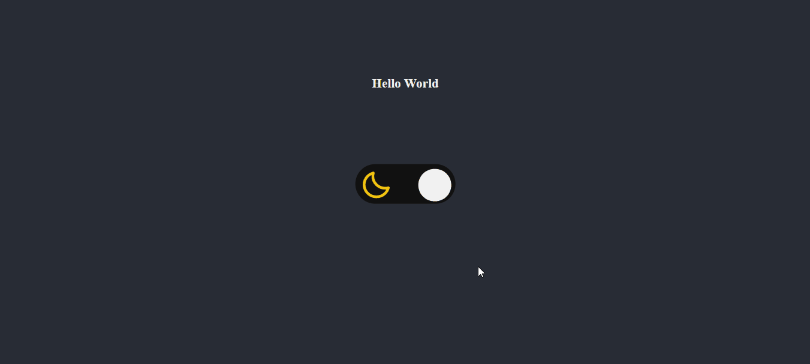

## 💻 Projeto

Desafio consiste em criar um controlador(toggle) que alterna entre modo claro e modo escuro

## 🚀 Tecnologias

<ul>
  <li>HTML</li>
  <li>CSS</li>
  <li>Javascript</li>
</ul>

## 🔖 Layout do Projeto

O layout pode ser visto através do Figma

[Layout Web](https://www.figma.com/file/hRc0AmyhikBTU9ONEU5VDC/DD-Theme-Switcher-Copy?fuid=1044716808414252537)
